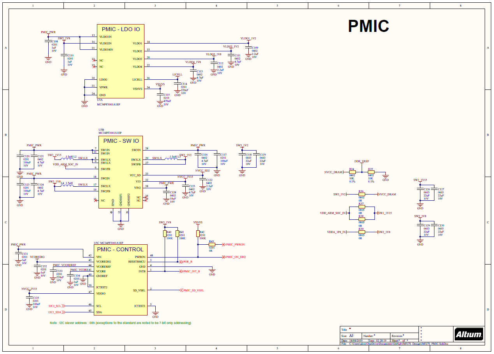
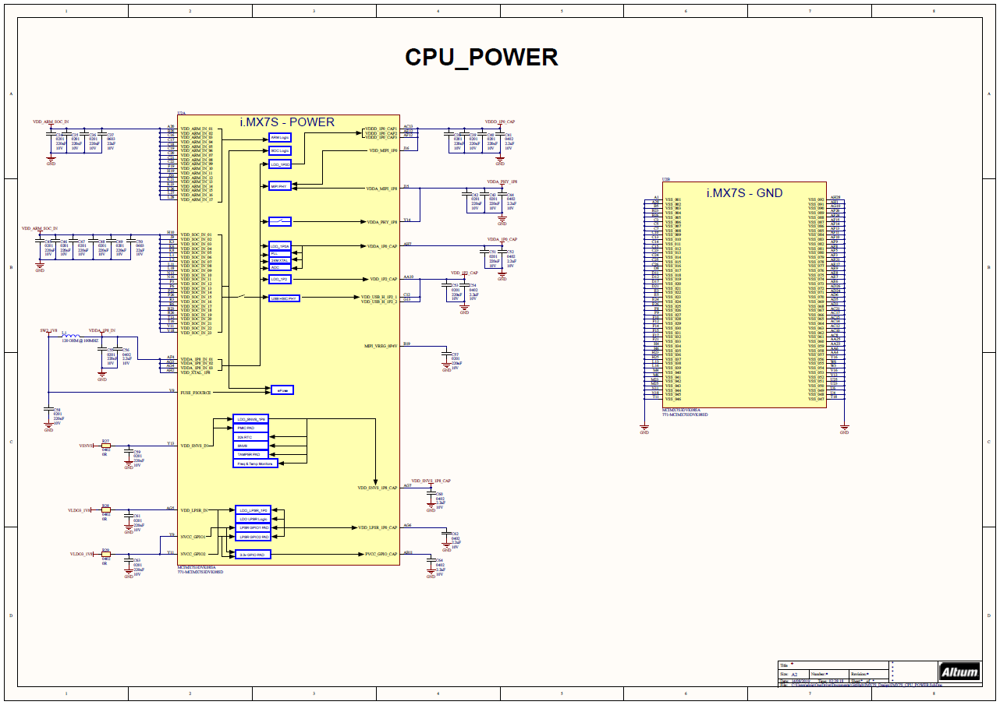
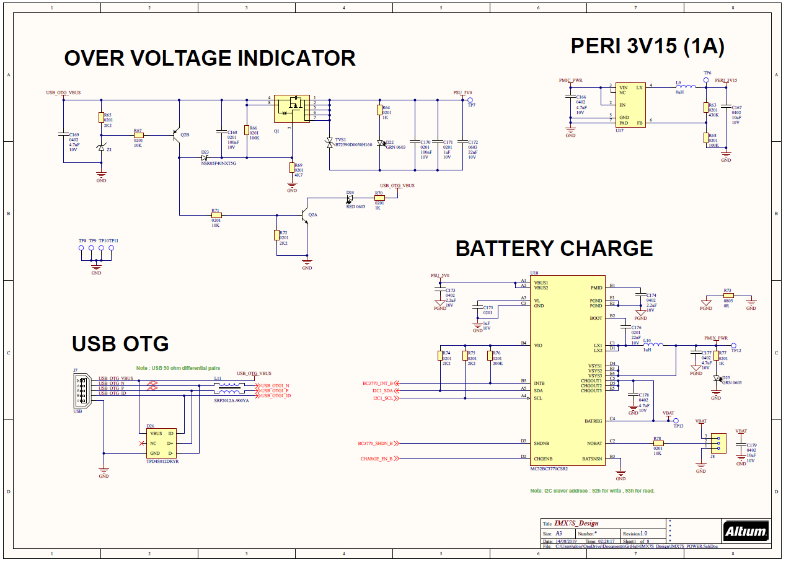
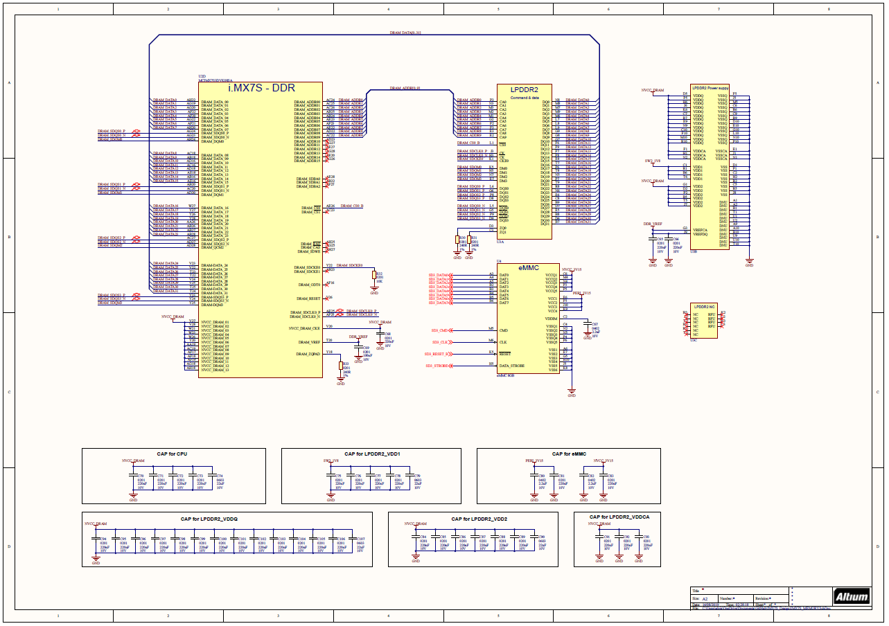
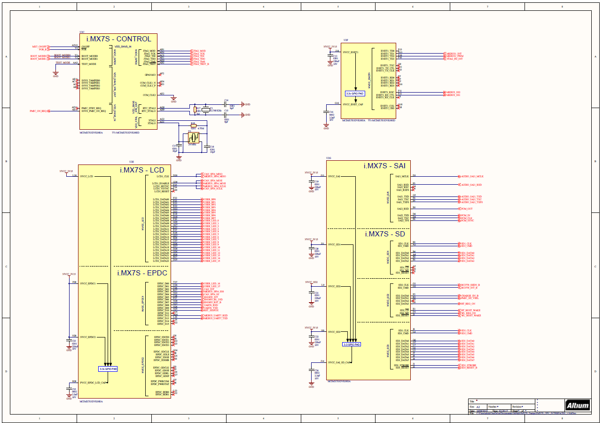
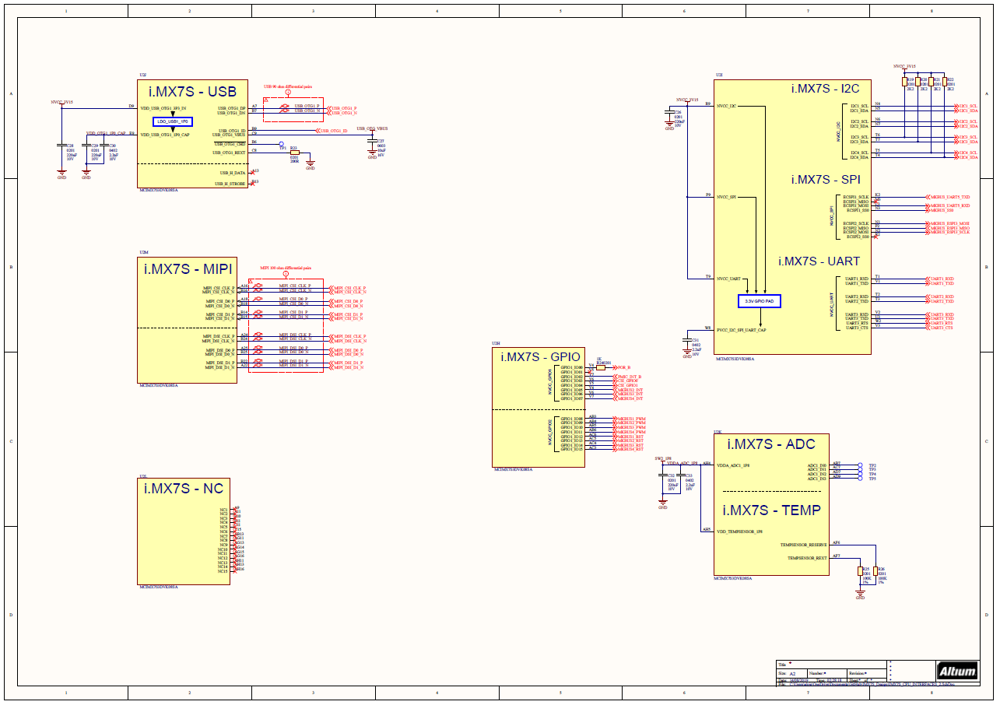
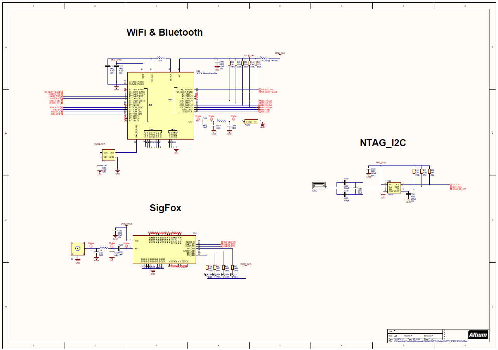
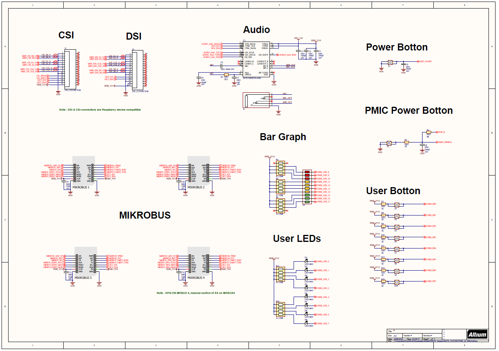

# IMX7S_Design

# Work in progress

## Schematics completed

###### PMIC

###### CPU Power

###### PMIC Management

###### Memory

###### CPU Interface

###### Wireless

###### CONNECTORS & HMI
